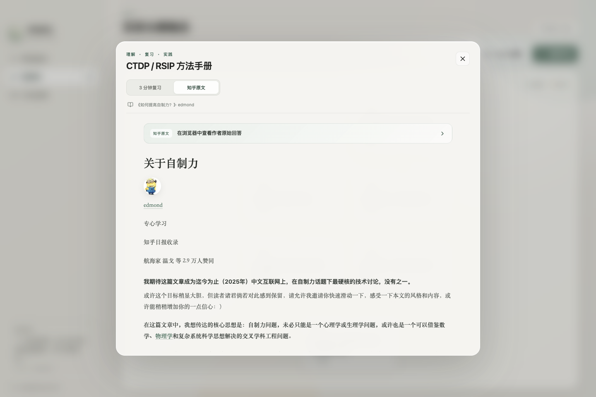

<div align="center">
  
  <h1>神圣座位</h1>
  <p>把一次承诺守成习惯，把模糊目标整理成可以执行的路径。</p>

  [](https://github.com/HOWILLMAKEIT/sacred-seat/releases/latest)
  [](https://tauri.app/)
  [](#数据与隐私)
  [](https://github.com/HOWILLMAKEIT/sacred-seat/releases/latest)
</div>

---

**神圣座位**是一款面向 macOS 的本地 CTDP / RSIP 桌面应用。它不靠复杂的打卡系统奖励你，而是帮助你明确一项承诺的触发条件、行为边界和永久判例，再把长期目标拆成能够逐步建立的国策树。

> 当前版本：`v0.1.1`。应用处于早期阶段，所有数据默认只保存在本机。

## 原理

本项目的主要思想来自 edmond 的知乎回答：[《如何提高自制力？》](https://www.zhihu.com/question/19888447/answer/1930799480401293785)。应用内也收录了作者原文与一份三分钟复习版，方便随时回顾。

### CTDP：守住一次承诺

- **神圣座位**：为一项行为指定清晰的触发动作。触发以后，不再临场议价。
- **链式记录**：每完成一次，当前链长增加；它记录的是连续守约，而不是抽象积分。
- **下必为例**：中止时只能判定失败，或者把该行为永久加入允许规则。例外一旦成立，此后必须采用同一标准。

### RSIP：改变长期稳态

很多目标无法靠一条规则直接实现。国策树把**最终目标放在下方**，把更容易先做到、能够改善环境的小目标放在上方。用户可以自由拖动节点、改变层级与分支，在实践中逐步整理出自己的行动路径。

本项目参考了 [KenXiao1/momentum](https://github.com/KenXiao1/momentum) 对 CTDP / RSIP 概念的产品化探索，但重新设计了 macOS 交互、视觉系统、数据模型和国策树操作方式。

## 功能介绍

### 1. 神圣座位与永久判例

为不同场景建立独立座位，设置触发动作、专注行为和持续时间。应用记录当前链长、累计坚持天数与每日完成次数；中止时必须立即完成规则判定。


### 2. 多座位与本地统计

书房、实验室、图书馆等场景可以分别维护。侧边栏使用类似 GitHub Contributions 的热力方格呈现最近 12 周完成情况。


> 截图中的坚持记录是为了展示界面而生成的示例数据，不代表真实用户记录。

### 3. 可自由整理的国策树

直接拖动节点即可交换顺序、改变层级或建立新分支；画布支持缩放、平移和自动适应全部节点。节点数量不设固定上限。


### 4. 可选的 Codex 辅助

当节点过多或目标尚不清晰时，可以调用本机 Codex CLI：

- 合并重复节点，压缩冗长规则并修复层级；
- 根据一个底层目标生成完整的参考链；
- 先展示建议，只有用户确认后才更新国策树。

Codex 以临时、只读会话运行，只接收当前目标和国策 JSON，不会直接修改应用数据。


### 5. 方法说明与原文阅读

应用内提供简洁复习版与知乎原文阅读器，保留原文图片，并可跳转到作者页面阅读全文。



## 下载与使用

### 安装应用

前往 [GitHub Releases](https://github.com/HOWILLMAKEIT/sacred-seat/releases/latest)，下载与 Mac 芯片对应的 DMG：

- `aarch64`：Apple Silicon（M1 / M2 / M3 / M4 等）
- `x86_64`：Intel Mac

打开 DMG，将“神圣座位”拖入“应用程序”即可。

当前版本采用 ad-hoc 签名，尚未经过 Apple 公证。首次启动若被 macOS 拦截：

1. 在 Finder 中右键应用并选择“打开”；或
2. 前往“系统设置 → 隐私与安全性”，选择“仍要打开”。

这不影响其他人下载和使用 DMG，只是首次启动会多一次系统确认。

### 基本使用

1. 新建一个神圣座位，写清触发动作、对应行为和时间。
2. 执行触发动作后点击“触发神圣座位”。
3. 完成后记录一次守约；若中止，立即进行失败或永久允许判定。
4. 在国策树中记录长期目标，再逐步添加更容易先做到的上层节点。

### 配置 Codex CLI（可选）

不使用 Codex 辅助时，**无需安装或配置 Codex**，其他功能可以完整使用。

如需国策整理功能，请先安装 Codex CLI，并在终端登录：

```bash
npm install -g @openai/codex
codex login
```

确认安装成功：

```bash
codex --version
codex login status
```

应用会自动寻找：

- `/opt/homebrew/bin/codex`
- `/usr/local/bin/codex`
- 当前 `PATH` 中的 `codex`

## 数据与隐私

- 神圣座位、完成记录、永久判例和国策树都保存在应用本机。
- 当前版本没有账号系统、云同步或自建服务器。
- Codex 辅助是唯一可选的外部模型调用；未配置时不会发送任何数据。

## 本地开发

需要 Node.js、npm、Rust 与 macOS 开发环境。

```bash
git clone https://github.com/HOWILLMAKEIT/sacred-seat.git
cd sacred-seat
npm install
npm run tauri:dev
```

构建安装包：

```bash
npm run tauri:build
```

生成 README 演示截图：

```bash
npm run dev -- --host 127.0.0.1
node scripts/readme-screenshots.mjs
```

## 发布与自动更新

推送 `v*` 标签后，[GitHub Actions](.github/workflows/release.yml) 会自动：

1. 构建 Apple Silicon 与 Intel Mac 安装包；
2. 创建 GitHub Release 并上传 DMG；
3. 生成带签名的更新包与 `latest.json`；
4. 为已经安装的应用提供自动更新。

`v0.1.1` 是首个支持自动更新的版本。首次安装需要手动下载；从后续版本开始，应用会在启动时检查更新并提示安装。

## 致谢

- [edmond：《如何提高自制力？》](https://www.zhihu.com/question/19888447/answer/1930799480401293785)：CTDP / RSIP 思想来源。
- [KenXiao1/momentum](https://github.com/KenXiao1/momentum)：CTDP / RSIP 产品化参考。
- [Tauri](https://tauri.app/) 与 [Codex CLI](https://developers.openai.com/codex/cli/)：桌面运行与可选智能整理能力。
